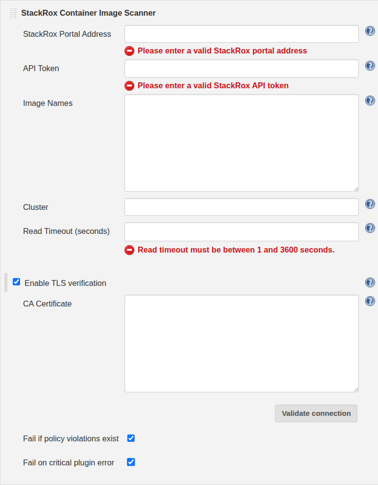

# StackRox Container Image Scanner
The **StackRox Container Image Scanner** plugin enables scanning of
container images for published software vulnerabilities. You can add it
as a build step in your freestyle projects or pipeline, to ensure your
infrastructure is in adherence with the StackRox Kubernetes Security
Platform vulnerability management policies.

The **[StackRox Kubernetes Security
Platform](https://www.stackrox.com/)** protects your cloud-native
applications across the entire container lifecycle: build, deploy, and
runtime. Leverage StackRox to gain visibility into your cloud-native
environment, to detect vulnerabilities and misconfigurations in your
container images and Kubernetes deployments, to identify high-risk
runtime activity, and to meet your internal and external compliance
requirements.

**Contents**
- [Prerequisites](#prerequisites)
- [Install the StackRox Container Image Scanner plugin](#install-the-stackrox-container-image-scanner-plugin)
    - [Web UI](#web-ui)
    - [Jenkins CLI](#jenkins-cli)
- [Use the StackRox Container Image Scanner plugin](#use-the-stackrox-container-image-scanner-plugin)
    - [Freestyle project](#freestyle-project)
    - [Pipeline](#pipeline)
- [View scan reports](#view-scan-reports)

## Prerequisites

To install, configure, and use the StackRox Container Image Scanner
plugin you must meet the following requirements:

1.  Use Jenkins version LTS 2.204.1 or newer.

2.  Use the StackRox Kubernetes Security Platform version 3.0.38 or
    newer.

3.  [Create an API
    token](https://help.stackrox.com/docs/use-the-api/#authentication)
    with the Continuous Integration (CI) role in the StackRox Kubernetes
    Security Platform.

4.  [Integrate the StackRox Kubernetes Security Platform with the image
    registry](https://help.stackrox.com/docs/integrate-with-other-tools/integrate-with-image-registries/)
    you use.

## Install the StackRox Container Image Scanner plugin

You can use [Web UI](#web-ui) or [Jenkins CLI](#jenkins-cli) to install
the StackRox Container Image Scanner plugin.

### Web UI

Use the Jenkins Plugin Manager in your Jenkins instance to install the
StackRox Container Image Scanner plugin.

1.  On the Jenkins homepage, go to the **Manage Jenkins** &gt; **Manage
    Plugins** view.

2.  Select the **Available** tab.

3.  Enter **stackrox** in the **Filter** box to search for the StackRox
    Container Image Scanner plugin.

4.  Select the checkbox under the **Install** column for the **StackRox
    Container Image Scanner** plugin.

5.  Select **Install without restart**.

### Jenkins CLI

Use the `install-plugin` command in [Jenkins
CLI](https://jenkins.io/doc/book/managing/cli/) to install the StackRox
Container Image Scanner plugin.

``` {.bash}
java -jar jenkins-cli.jar -s <jenkins-address> install-plugin stackrox-container-image-scanner -deploy
```

## Use the StackRox Container Image Scanner plugin

You can use the StackRox Container Image Scanner plugin in both
freestyle projects and pipelines.

> **Important**
>
> You must push your images to the registry you configured in your build
> steps, before you invoke the StackRox Container Image Scanner plugin
> step in a Jenkins FreeStyle project or a Pipeline.

### Freestyle project

1.  Add a build step in your project to save names of all the images you
    want to scan in the
    `<jenkins-workspace>/${BUILD_TAG}/rox_images_to_scan` file. Each
    image name must be on a separate line.

    

    For example, to do this:

    -   Select **Add build step** &gt; **Execute shell**.

    -   In the command box, enter:

        ``` {.bash}
        mkdir $BUILD_TAG
        cd $BUILD_TAG
        echo "nginx:latest" >> rox_images_to_scan
        echo "stackrox/vuln-images:django-cve-2019-14235" >> rox_images_to_scan
        ```

2.  Add the StackRox Container Image Scanner plugin step. Select **Add
    build step** &gt; **StackRox Image Security**.

3.  Enter details for the following plugin configuration variables:

    <table>
    <colgroup>
    <col width="33%" />
    <col width="33%" />
    <col width="33%" />
    </colgroup>
    <thead>
    <tr class="header">
    <th>Variable</th>
    <th>Name</th>
    <th>Description</th>
    </tr>
    </thead>
    <tbody>
    <tr class="odd">
    <td><p><code>portalAddress</code></p></td>
    <td><p>Portal address <sup>*</sup></p></td>
    <td><p>Your StackRox Portal address.</p></td>
    </tr>
    <tr class="even">
    <td><p><code>apiToken</code></p></td>
    <td><p>API token <sup>*</sup></p></td>
    <td><p>The StackRox access token with the Continuous Integration (CI) authorization role.</p></td>
    </tr>
    <tr class="odd">
    <td><p><code>enableTLSVerification</code></p></td>
    <td><p>Enable TLS verification</p></td>
    <td><p>Use it to enable TLS. You must also specify a CA certificate.</p></td>
    </tr>
    <tr class="even">
    <td><p><code>caCertPEM</code></p></td>
    <td><p>CA certificate</p></td>
    <td><p>Use it to specify a CA certificate in PEM format. Make sure to include the BEGIN CERTIFICATE and END CERTIFICATE tags for your certificate.</p>
    <blockquote>
    <p><strong>Note</strong></p>
    <p>You can download the certificate in PEM format from the sensor bundle in any of cluster where you’ve installed StackRox Sensor. If you don’t have administrative access to your cluster, please ask your system administrator to get the certificate.</p>
    </blockquote></td>
    </tr>
    <tr class="odd">
    <td><p><code>failOnCriticalPluginError</code></p></td>
    <td><p>Fail on critical plugin errors</p></td>
    <td><p>Enable this to fail the build if the plugin encounters any errors. This value is <code>TRUE</code> by default.</p></td>
    </tr>
    <tr class="even">
    <td><p><code>failOnPolicyEvalFailure</code></p></td>
    <td><p>Fail if policy violations exist</p></td>
    <td><p>Enable this to fail the build if scanned images violate any <a href="https://help.stackrox.com/docs/deploy-security-policies/">enforced system policies</a> in the StackRox Kubernetes Security Platform. This value is <code>TRUE</code> by default.</p>
    <blockquote>
    <p><strong>Note</strong></p>
    <p>If you don’t enable <code>failOnPolicyEvalFailure</code>, the plugin will not fail the build even if the StackRox Kubernetes Security Platform reports system policy violations.</p>
    </blockquote></td>
    </tr>
    <tr class="odd">
    <td colspan="3"><p><em><sup>*</sup> Required</em></p></td>
    </tr>
    </tbody>
    </table>

    

4.  Select **Save** and then select **Apply**.

### Pipeline

To use the StackRox Container Image Scanner plugin in your pipeline:

1.  Go to the pipeline configuration screen.

2.  In the **Script** text area, enter the following script:

        node {
            stage('Stackrox Image Security') {
                steps {
                    step ([
                        $class: 'StackroxBuilder', 
                        portalAddress: <portal-address>,
                        apiToken: <api-token>,
                        enableTLSVerification: <true-or-false>,
                        caCertPEM: <ca-cert-pem-format>,
                        failOnCriticalPluginError: <true-or-false>,
                        failOnPolicyEvalFailure: <true-or-false>
                        ])
                }
            }
        }

    -   For more information about the variables, see the [plugin
        configuration variables](#plugin-configuration-variables)
        section.

    

## View scan reports

Whenever you use the StackRox Container Image Scanner plugin to scan
images, the StackRox Container Image Scanner creates reports as build
artifacts. These reports include detailed information in CSV format. The
StackRox Container Image Scanner generates the following two CSV format
reports for every scanned image:

1.  CVEs found in the image.

2.  Policy violations for the image.

The StackRox Container Image Scanner also creates an HTML report for
every build. This report includes a summary of the scan results for all
scanned images in your environment.

To view the HTML report:

1.  Select **StackRox Image Security Report** from the left-hand
    navigation menu.

    
